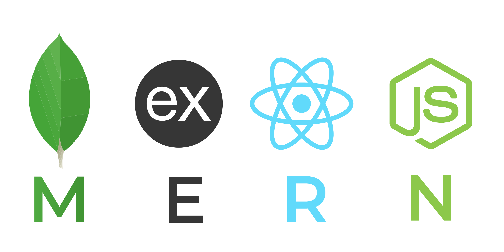

# mq-artist-page-building-webapp
Personal Proyect for Martina Quesada (renowned plastic modern artist) Construction and building of MPA

<h2>Main Technologies used:</h2>
<ul>
 <li></img></li>
 
MONGODB, EXPRESS, REACTjs, NODEjs

  
 <li></img></li>
 
HTML, CSS, JAVASCRIPT

</ul>

<h3>Others:</h3>
<ul>
<li></img></li>
<li></img></li>
<li></img></li>
<li></img></li>
<li></img></li>
</ul>